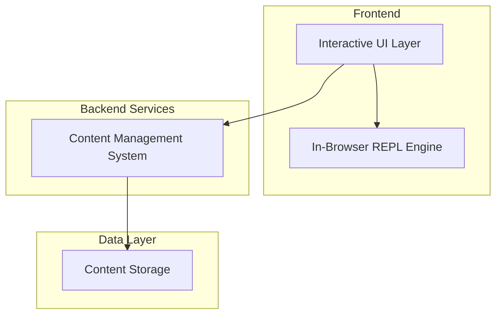

# Design Document

## Overview

The Interactive Programming Tutorial is a web-based application that transforms static programming education content into an interactive learning experience. The system preserves the carefully crafted pedagogical approach of the source material while adding multi-language support and real-time code execution capabilities.

The architecture centers around three core components: a Content Management System that processes tutorial material, a Multi-Language REPL Engine that provides safe code execution, and an Interactive UI that seamlessly integrates content consumption with hands-on experimentation.

## Architecture

### High-Level Architecture



### Component Architecture

The system follows a modular architecture with clear separation of concerns:

- **Frontend**: React-based SPA with integrated Monaco Editor for REPL and in-browser language runtimes
- **Backend**: Node.js/Express API for content management and delivery
- **Execution Environment**: In-browser WebAssembly-based language interpreters for safe code execution

## Components and Interfaces

### Content Management System

**Purpose**: Processes source material and manages tutorial content delivery

**Key Responsibilities**:
- Parse markdown content from book source files
- Extract and catalog code snippets
- Maintain content structure and navigation hierarchy
- Serve content based on selected language

**Interface**:
```typescript
interface ContentService {
  getSection(sectionId: string, language: Language): Promise<TutorialSection>
  getAllSections(language: Language): Promise<TutorialSection[]>
  getCodeSnippets(sectionId: string, language: Language): Promise<CodeSnippet[]>
}

interface TutorialSection {
  id: string
  title: string
  content: string
  codeSnippets: CodeSnippet[]
  nextSection?: string
  previousSection?: string
}
```

### In-Browser REPL Engine

**Purpose**: Provides client-side code execution environments for multiple programming languages using in-browser runtimes

**Key Responsibilities**:
- Maintain persistent execution contexts per user session in browser memory
- Execute code safely using in-browser language interpreters/compilers
- Handle errors gracefully with educational feedback
- Support variable persistence across expressions within the browser session

**Execution Flow**:
1. Receive code expression from UI components
2. Validate and sanitize input on client-side
3. Route to appropriate in-browser language runtime
4. Execute code in browser-based interpreter/compiler
5. Capture output, errors, and state changes
6. Update UI with results immediately

**In-Browser Runtime Technologies**:
- **Python**: Pyodide (Python scientific stack compiled to WebAssembly)
- **JavaScript**: Native browser JavaScript engine
- **TypeScript**: TypeScript compiler + JavaScript execution
- **Ruby**: ruby.wasm (Ruby interpreter compiled to WebAssembly)

**Interface**:
```typescript
interface REPLService {
  executeCode(code: string, language: Language): Promise<ExecutionResult>
  initializeRuntime(language: Language): Promise<void>
  getSessionState(language: Language): SessionState
  resetSession(language: Language): void
}

interface ExecutionResult {
  output: string
  error?: string
  variables: Record<string, any>
  executionTime: number
}
```

### Interactive UI Components

**Purpose**: Provides intuitive interface for content consumption and code interaction

**Key Components**:

1. **Language Selector**: Dropdown for choosing programming language
2. **Content Viewer**: Renders tutorial sections with interactive code snippets
3. **Code Snippet Enhancer**: Adds hover interactions and "Send to REPL" buttons
4. **Integrated REPL**: Monaco Editor-based REPL occupying bottom quarter of screen
5. **Navigation Panel**: Section navigation with progress tracking

**Code Interaction Flow**:
1. User hovers over code snippet
2. System displays "Send to REPL" button
3. User clicks button
4. Code is sent to REPL and executed
5. Results appear in REPL output area
6. REPL maintains context for subsequent interactions

## Data Models

### Content Models

```typescript
interface CodeSnippet {
  id: string
  code: string
  language: Language
  isExecutable: boolean
  context: string
  explanation?: string
}

interface Language {
  id: string
  name: string
  fileExtension: string
  replCommand: string
  syntaxHighlighting: string
}

interface UserSession {
  id: string
  selectedLanguage: Language
  currentSection: string
  replState: SessionState
  progress: ProgressTracker
}
```

### REPL Models

```typescript
interface SessionState {
  variables: Record<string, any>
  functions: Record<string, Function>
  imports: string[]
  executionHistory: ExecutionRecord[]
}

interface ExecutionRecord {
  timestamp: Date
  input: string
  output: string
  error?: string
}
```

## Error Handling

### Code Execution Errors

**Strategy**: Convert technical errors into educational feedback

**Implementation**:
- Catch common syntax errors and provide beginner-friendly explanations
- Map runtime errors to conceptual misunderstandings
- Suggest corrections based on error patterns
- Maintain error context for learning progression

**Example Error Transformations**:
- `NameError: name 'x' is not defined` → "The variable 'x' hasn't been created yet. Remember to assign a value to a variable before using it."
- `SyntaxError: invalid syntax` → "There's a syntax error in your code. Check for missing colons, parentheses, or quotes."

### System Errors

**Strategy**: Graceful degradation with user-friendly messaging

**Implementation**:
- REPL service failures: Display offline message with local execution option
- Content service errors: Fall back to cached content
- Content loading errors: Show cached content or basic error page

## Testing Strategy

### Unit Testing

**Content Management**:
- Test markdown parsing and content extraction
- Verify navigation structure generation
- Validate content caching mechanisms


**REPL Engine**:
- Test code execution in isolated environments
- Verify session state persistence
- Test error handling and security measures

### Integration Testing

**End-to-End Workflows**:
- Complete user journey from language selection to code execution
- Multi-language execution consistency
- Session persistence across navigation

**Performance Testing**:
- REPL response times under load
- Content loading and translation performance
- Memory usage in long-running sessions

### User Acceptance Testing

**Educational Effectiveness**:
- Verify preservation of book's pedagogical approach
- Test comprehension with target age group (10+ years)
- Validate interactive features enhance learning

**Usability Testing**:
- Interface intuitiveness for young learners
- Code interaction discoverability
- REPL usability and error recovery

## Security Considerations

### Code Execution Security

**Browser Sandboxing**: All code execution occurs within the browser's security sandbox:
- WebAssembly provides memory isolation
- No access to file system or network resources
- Limited to browser's security context
- Automatic cleanup when page is closed or refreshed

**Input Validation**:
- Sanitize all user input before execution
- Block potentially dangerous operations at the language runtime level
- Implement client-side rate limiting for code execution

### Data Protection

**Session Management**:
- Use secure session tokens
- Implement session timeout
- Clear sensitive data on session end

**Content Security**:
- Validate all content before rendering
- Sanitize user-generated content
- Implement CSP headers for XSS protection

## Performance Optimization

### Frontend Optimization

**Code Splitting**: Load tutorial sections on-demand
**Caching**: Cache translated content and user preferences
**Lazy Loading**: Load REPL components only when needed

### Backend Optimization

**Content Caching**: Cache content with intelligent invalidation
**Database Optimization**: Index content for fast retrieval
**API Response Optimization**: Minimize payload sizes and response times

### REPL Performance

**Runtime Initialization**: Lazy-load language runtimes only when needed
**Result Caching**: Cache execution results for identical expressions in browser storage
**Memory Management**: Implement garbage collection for long-running sessions
**WebAssembly Optimization**: Use optimized WASM builds for better performance
