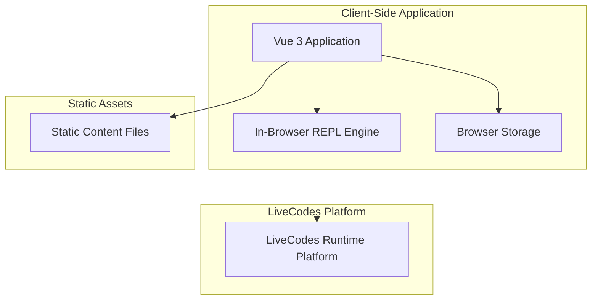

# Design Document

## Overview

The Vue 3 migration transforms the Interactive Programming Tutorial from a React-based application with backend dependencies into a modern, fully client-side Vue 3 application. This design eliminates server-side complexity while preserving all interactive functionality through static content delivery and in-browser code execution.

The architecture centers around three core principles: **Static Content Delivery** for tutorial materials, **Client-Side State Management** using Vue 3's reactive system, and **In-Browser Code Execution** using LiveCodes as a unified runtime platform. This approach simplifies deployment, reduces infrastructure costs, and provides robust multi-language support while maintaining the same rich interactive learning experience.

## Architecture

### High-Level Architecture



### Component Architecture

The Vue 3 application follows a composition-based architecture with clear separation of concerns:

- **Vue 3 Frontend**: Single-page application using Composition API and TypeScript
- **Static Content**: Markdown files and assets served directly from the build
- **In-Browser Execution**: WebAssembly-based language interpreters for safe code execution
- **Client Storage**: Browser APIs for session and preference persistence

## Components and Interfaces

### Vue 3 Application Structure

**Purpose**: Main application shell managing routing, state, and component orchestration

**Key Components**:
- **App.vue**: Root application component with router-view
- **TutorialLayout.vue**: Main layout with header, full-width content area, and dockable REPL
- **LanguageSelector.vue**: Enhanced language selection component with visual feedback
- **TutorialContent.vue**: Full-width markdown content renderer with interactive code blocks
- **DockableREPL.vue**: Resizable REPL panel that docks to bottom or right without overlaying content

**State Management Pattern**:
```typescript
// Composable for global application state
export function useAppState() {
  const selectedLanguage = ref<Language | null>(null)
  const currentSection = ref<TutorialSection | null>(null)
  const isREPLVisible = ref(true)
  const replState = reactive<REPLState>({
    sessionId: null,
    isExecuting: false,
    history: [],
    variables: {}
  })

  return {
    selectedLanguage,
    currentSection,
    isREPLVisible,
    replState,
    // ... methods
  }
}
```

### Static Content Management

**Purpose**: Serve tutorial content as static files without backend processing

**Content Structure**:
```
public/
├── content/
│   ├── sections/
│   │   ├── introduction.md
│   │   ├── variables.md
│   │   └── functions.md
│   ├── manifest.json
│   └── assets/
└── ...
```

**Content Loading Service**:
```typescript
interface StaticContentService {
  loadSection(sectionId: string): Promise<TutorialSection>
  loadManifest(): Promise<ContentManifest>
  parseMarkdownContent(content: string, language: Language): TutorialSection
}

interface ContentManifest {
  sections: SectionMetadata[]
  navigation: NavigationStructure
  lastUpdated: string
}
```

### Enhanced Language Selector

**Purpose**: Prominent, user-friendly language selection with visual feedback

**Design Features**:
- Dropdown with language icons and clear labels
- Visual indication of current selection
- Smooth transitions and hover effects
- Persistent selection across sessions
- Integration with REPL runtime switching

**Component Interface**:
```vue
<template>
  <div class="language-selector-enhanced">
    <label class="selector-label">Choose Language:</label>
    <div class="selector-dropdown" :class="{ open: isOpen }">
      <button class="selector-button" @click="toggleDropdown">
        <LanguageIcon :language="selectedLanguage" />
        <span>{{ selectedLanguage?.name || 'Select Language' }}</span>
        <ChevronIcon :rotated="isOpen" />
      </button>
      <div class="dropdown-menu" v-show="isOpen">
        <button
          v-for="language in languages"
          :key="language.id"
          class="language-option"
          @click="selectLanguage(language)"
        >
          <LanguageIcon :language="language" />
          <span>{{ language.name }}</span>
        </button>
      </div>
    </div>
  </div>
</template>
```

### In-Browser REPL Engine

**Purpose**: Client-side code execution using LiveCodes unified runtime platform

**LiveCodes Integration**:
- **Unified API**: Single interface for 80+ programming languages
- **Built-in Features**: Syntax highlighting, auto-completion, error handling
- **Language Support**: Python, JavaScript, TypeScript, Ruby, Go, C++, Java, PHP, and many more
- **Sandboxed Execution**: Secure in-browser code execution with proper isolation
- **Educational Features**: Clear error messages and educational feedback

**Execution Service**:
```typescript
import { createPlayground } from 'livecodes'

class LiveCodesREPL {
  private playground: any = null
  private currentLanguage: string = 'python'

  async initializeRuntime(language: Language): Promise<void> {
    if (!this.playground) {
      this.playground = await createPlayground({
        appUrl: 'https://livecodes.io/',
        config: {
          activeEditor: 'script',
          languages: [language.id],
          mode: 'result',
          tools: { enabled: 'none' },
          readonly: false
        }
      })
    }

    // Switch language if different
    if (this.currentLanguage !== language.id) {
      await this.playground.setConfig({
        activeEditor: 'script',
        languages: [language.id]
      })
      this.currentLanguage = language.id
    }
  }

  async executeCode(code: string, language: Language): Promise<ExecutionResult> {
    if (!this.playground) {
      await this.initializeRuntime(language)
    }

    const startTime = performance.now()

    try {
      // Set the code and run it
      await this.playground.setConfig({
        script: { language: language.id, content: code }
      })

      const result = await this.playground.run()
      const executionTime = performance.now() - startTime

      return {
        output: result.console || '',
        error: result.error,
        variables: result.variables || {},
        executionTime,
        timestamp: new Date()
      }
    } catch (error) {
      return {
        output: '',
        error: error.message,
        variables: {},
        executionTime: performance.now() - startTime,
        timestamp: new Date()
      }
    }
  }

  async resetSession(): Promise<void> {
    if (this.playground) {
      await this.playground.setConfig({
        script: { content: '' }
      })
    }
  }
}
```

### Client-Side Storage

**Purpose**: Persist user preferences and session data using browser storage

**Storage Strategy**:
- **localStorage**: Language preferences, tutorial progress
- **sessionStorage**: Current session state, REPL history
- **IndexedDB**: Large data like execution history (if needed)

**Storage Service**:
```typescript
interface ClientStorage {
  // Preferences (persistent)
  saveLanguagePreference(language: Language): void
  loadLanguagePreference(): Language | null
  saveProgress(progress: ProgressTracker): void
  loadProgress(): ProgressTracker | null

  // Session data (temporary)
  saveREPLState(state: REPLState): void
  loadREPLState(): REPLState | null
  clearSession(): void
}
```

## Data Models

### Vue 3 Reactive Models

```typescript
// Core application state
interface AppState {
  selectedLanguage: Ref<Language | null>
  currentSection: Ref<TutorialSection | null>
  isREPLVisible: Ref<boolean>
  isLoading: Ref<boolean>
  error: Ref<string | null>
}

// REPL state management
interface REPLState {
  sessionId: string | null
  isExecuting: boolean
  history: ExecutionRecord[]
  variables: Record<string, any>
  currentInput: string
}

// Static content models
interface TutorialSection {
  id: string
  title: string
  content: string
  codeSnippets: CodeSnippet[]
  nextSection?: string
  previousSection?: string
  order: number
}

interface CodeSnippet {
  id: string
  code: string
  language: string
  isExecutable: boolean
  context: string
  explanation?: string
}
```

### Content Manifest Structure

```typescript
interface ContentManifest {
  sections: SectionMetadata[]
  navigation: NavigationStructure
  languages: Language[]
  version: string
  lastUpdated: string
}

interface SectionMetadata {
  id: string
  title: string
  order: number
  filename: string
  dependencies?: string[]
}
```

## Error Handling

### Client-Side Error Management

**Strategy**: Comprehensive error handling with user-friendly feedback and graceful degradation

**Error Categories**:

1. **Content Loading Errors**:
   - Network failures when loading static content
   - Malformed markdown or missing files
   - Fallback to cached content or error pages

2. **Code Execution Errors**:
   - Runtime initialization failures
   - Code execution timeouts or crashes
   - Educational error message transformation

3. **State Management Errors**:
   - Storage quota exceeded
   - Corrupted session data
   - Automatic state recovery

**Error Handling Implementation**:
```typescript
// Global error handler composable
export function useErrorHandler() {
  const error = ref<string | null>(null)
  const isRecovering = ref(false)

  const handleError = async (err: Error, context: string) => {
    console.error(`Error in ${context}:`, err)

    // Transform technical errors to user-friendly messages
    const userMessage = transformError(err, context)
    error.value = userMessage

    // Attempt automatic recovery
    if (canRecover(err, context)) {
      isRecovering.value = true
      await attemptRecovery(err, context)
      isRecovering.value = false
    }
  }

  return { error, isRecovering, handleError }
}
```

## Testing Strategy

### Vue 3 Testing Approach

**Unit Testing with Vitest**:
- Component testing using Vue Test Utils
- Composable testing for state management
- Service testing for content loading and REPL execution

**Integration Testing**:
- End-to-end user workflows
- REPL integration with different language runtimes
- Content loading and navigation flows

**Visual Regression Testing**:
- Component snapshot testing
- Cross-browser compatibility testing
- Responsive design validation

**Testing Structure**:
```typescript
// Component testing example
describe('LanguageSelector.vue', () => {
  it('displays all supported languages', async () => {
    const wrapper = mount(LanguageSelector, {
      props: { languages: SUPPORTED_LANGUAGES }
    })

    await wrapper.find('.selector-button').trigger('click')
    const options = wrapper.findAll('.language-option')

    expect(options).toHaveLength(SUPPORTED_LANGUAGES.length)
  })
})

// Composable testing example
describe('useAppState', () => {
  it('persists language selection', () => {
    const { selectedLanguage, setLanguage } = useAppState()

    setLanguage(SUPPORTED_LANGUAGES[0])

    expect(localStorage.getItem('selected_language')).toBe('python')
    expect(selectedLanguage.value?.id).toBe('python')
  })
})
```

## Performance Optimization

### Client-Side Performance

**Bundle Optimization**:
- Code splitting by route and language runtime
- Lazy loading of WebAssembly modules
- Tree shaking for unused dependencies

**Runtime Performance**:
- Virtual scrolling for large execution histories
- Debounced input handling in REPL
- Efficient reactive state updates

**Caching Strategy**:
- Service worker for static content caching
- Browser cache for WebAssembly modules
- Memory caching for parsed content

**Performance Monitoring**:
```typescript
// Performance tracking composable
export function usePerformanceMonitor() {
  const metrics = reactive({
    contentLoadTime: 0,
    runtimeInitTime: 0,
    executionTime: 0
  })

  const trackContentLoad = async (loader: () => Promise<any>) => {
    const start = performance.now()
    const result = await loader()
    metrics.contentLoadTime = performance.now() - start
    return result
  }

  return { metrics, trackContentLoad }
}
```

## Security Considerations

### Client-Side Security

**Code Execution Security**:
- WebAssembly sandbox isolation
- No file system or network access from executed code
- Automatic timeout for long-running executions
- Memory limits for runtime environments

**Content Security**:
- Content Security Policy headers
- XSS prevention in markdown rendering
- Input sanitization for user code

**Data Protection**:
- No sensitive data storage in browser
- Secure handling of user preferences
- Clear data on session end

## Migration Strategy

### Phased Migration Approach

**Phase 1: Vue 3 Foundation**
- Set up Vue 3 project with TypeScript and Vite
- Create basic component structure
- Implement routing with Vue Router 4

**Phase 2: Static Content Integration**
- Convert backend content API to static file serving
- Implement client-side content loading
- Migrate markdown rendering and syntax highlighting

**Phase 3: REPL Migration**
- Port in-browser execution services
- Integrate Monaco Editor with Vue 3
- Implement session state management

**Phase 4: Enhanced Language Selector**
- Design and implement improved language selector
- Add visual enhancements and user feedback
- Integrate with REPL runtime switching

**Phase 5: Testing and Optimization**
- Comprehensive testing suite
- Performance optimization
- Visual regression testing

### Deployment Simplification

**Static Hosting**:
- Build output can be deployed to any static hosting service
- No server-side infrastructure required
- CDN-friendly with proper caching headers

**Development Workflow**:
- Hot module replacement for fast development
- Integrated development server with Vite
- Simplified build and deployment pipeline
