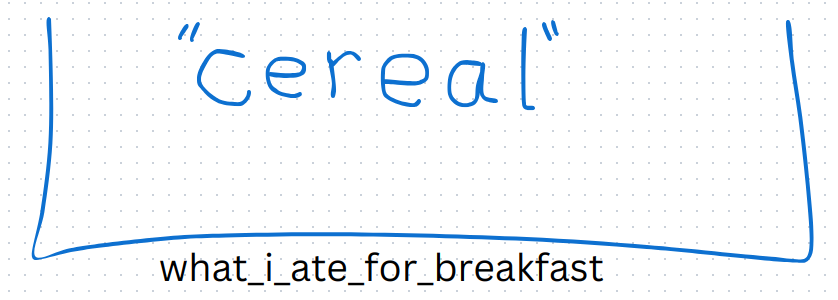

## Python Programming Introduction

<br>

# Comments

- lines that start with a # are comments
- comments are just explanations about something
- comments are ignored by the python interpreter

<br>

```python
# this line is a comment
# everything to the right of a # symbol is a comment and is ignored by the Python interpreter
```

<br>

# Values

A value is either:

- a number, for example:
    - `1` 
    - `1.4` 
    - `3.141592653589793` 
    - `1000` 
    - `1000000` 
    - `1_000_000  # numbers may not have commas in them, but may use underscores instead` 
- a quoted string, for example:
    - `"my name is David"` 
    - `"I ate a sleeve of cookies"` 
    - `"I had to exercise"` 
- a boolean true or false value, for example:
    - `True` 
    - `False` 
- a list of values, for example:
    - `[1, 3, 5, 7, 9]` 
    - `[3.141592653589793, "pi", "pie"]` 
    - `[1000, "cookies", True]` 
    - `[0, "cookies", False]` 
- a dictionary is a list of associated key/value pairs, for example:
    - `{1: "one", 2: "two", 3: "three"}`
    - `{"Jack": "Cookies", "Jill": "Ice Cream", "Phil": "Asparagus"}`  
- an instance of a class (more on this later)

<br>

# Sets

A set is a collection of unique values, like the list of all the words in the dictionary. Each word appears only once.

In other words, a set is a group of values where every value is different; there cannot be two of anything.

<br>

This is a set of three numbers:

- `1` 
- `2` 
- `3` 

<br>

This is a set of two names:

- `"Jack"` 
- `"Jill"` 

<br>

This is a set of different kinds of things:

- `1` 
- `3.141592653589793` 
- `"Steve"` 
- `True` 

<br>

This is **not** a set (because some values are repeated):

- `1` 
- `1` 
- `3.141592653589793`

<br>

Sets in python are notated with curly braces:

- `{1,2,3}` 
- `{"Jack", "Jill"}` 
- `{1, 3.141592653589793, "Steve", True}` 

<br>

# Types

A type is a named set of values; it’s a set that we give a name to.

<br>

We can name a set of values however we want. For example:

- We could call the set `{1,2,3}` **TinyNumber**
    - The type **TinyNumber** is the set of values `{1,2,3}` 
- We could give the name **DogName** to the set `{"Max", "Ace", "Tiny"}`
    - The type **DogName** is the set of values `{"Max", "Ace", "Tiny"}` 
- We could name the set `{99, 100, 101}` **AgeOfAnOldPerson**
    - The type **AgeOfAnOldPerson** is the set of values `{99, 100, 101}` 
- We could say **SmallOddNumber** is the set `{1, 3, 5, 7, 9}`
    - The type **SmallOddNumber** is the set `{1, 3, 5, 7, 9}`

<br>

If a value is in the set belonging to a type name, then we say the value is of that type, or we say that the value has that type.

- Since `1`  is in the **TinyNumber** set:
    - we say, 1 is of type TinyNumber
    - we say, 1 has the type TinyNumber
- Since `1`  is in the **SmallOddNumber** set
    - we say, 1 is of type SmallOddNumber
    - we say, 1 has the type SmallOddNumber
- Since `99`  is in the **AgeOfAnOldPerson** set
    - we say, 99 is of type AgeOfAnOldPerson
    - we say, 99 has the type AgeOfAnOldPerson
- Since `"Max"` is in the **DogName** set
    - we say, `"Max"` is of type DogName
    - we say `"Max"` has the type DogName

<br>

In python, there is a type called `int` that is the set of all numbers **without** a decimal point:

- ...
- `-3`
- `-2`
- `-1`
- `0` 
- `1` 
- `2`
- `3`  
- ...

<br>

There is a type called `float`  that is the set of all numbers **with** a decimal point:

- ... (numbers less than -3.0)
- `-3.0` 
- ... (numbers between -3.0 and -1.0)
- `-1.0`
- ... (numbers between -1.0 and 0.0) 
- `0.0` 
- ... (numbers between 0.0 and 1.0)
- `1.0` 
- ... (numbers between 1.0 and 1.1)
- `1.1` 
- ... (numbers between 1.1 and 1.2)
- `1.2` 
- ... (numbers between 1.2 and 1000.0)
- `1000.0` 
- ... (numbers greater than 1000.0)

<br>

Python has a bunch of built in types:

- `bool` - boolean
- `int` - integers (numbers without a decimal point)
- `float` - floating point numbers (numbers with a decimal point)
- `str` - strings
- `set` - sets
- `dict` - dictionary (also called a map)

<br>

# Variables and Assignment

A variable is a name that points at a particular value.

<br>

There are two simple ways to think about a variable:

1. You can think of a variable as a name that we use to point at a value
    - For example:
        - what\_i\_ate\_for\_breakfast → `"cereal"` 
        - my\_current\_age → `10.5` 

2. You can also think of a variable as a box with name on it and it holds a value inside
    - For example:
        - 
        - 

<br>

<br>

We name a variable with letters, numbers, and the underscore character, for example:

- `firstName` 
- `last_name` 
- `myAge` 
- `what_i_ate_for_breakfast` 
- `name1` 
- `name2` 

<br>

We can’t use spaces in variable names.

<br>

We use the equal sign, `=` , to make a variable point at a value, or put a value into the box, like this:

```python
my_age_last_year = 25
```

This makes the `my_age_last_year` variable point to the value `25` .

This puts the value `25` into the box named `my_age_last_year`, like this:

<br>

<br>

The equal sign, `=` , is called the assignment operator.

When we use the assignment operator, `=` , to make a variable point at a value, we call that an assignment expression.

In an assignment expression, we use the `=` operator to assign the value on the right hand side of the `=`  operator to the variable on the left hand side of the `=` operator.

These are all assignment expressions:

- `my_age = 25` 
- `my_first_word = "cookie"` 
- `number_of_cookies_i_want_to_eat = 100` 

<br>

When we use the name of a variable by itself, without the assignment operator, we are reading the value that the variable points at, or we are opening the box and reading the value inside.

To show an example, we can run the following code in the python interpreter:

```shell
❯ python
Python 3.12.5 (main, Aug 14 2024, 05:08:31) [Clang 18.1.8 ] on linux
Type "help", "copyright", "credits" or "license" for more information.
>>> my_age = 25
>>> my_age
25
```

In this code snippet, we are running the python interpreter in its interactive mode (called the read-evaluate-print-loop, or REPL for short), and assigning the value `25`  to the variable named `my_age`, and then we read the value stored in the `my_age` variable by entering the name of the variable by itself and pressing enter; the REPL shows us that the value `25` is currently stored in the variable named `my_age` .

<br>

# Expressions

So far, we have seen several different kinds of expression:

- value literal expressions
    - `123` - integer literal expressions
    - `3.14159` - floating point literal expressions
    - `True` - boolean literal expressions
    - `"Max"` - string literal expressions
    - `[1, 2, 3, 1, 2, 3]` - list literal expressions
    - `{1, 2, 3}` - set literal expressions
- variable evaluation expressions
    - `my_age`
    - `what_i_ate_for_breakfast` 
- assignment expressions
    - `what_i_ate_for_breakfast = "cereal"` 
    - `my_age = 25` 
    - `i_am_smart = True` 
    - `i_am_hungry = True` 

<br>

You can think of an expression as a sentence that a programming language interpreter knows how to interpret.

<br>

There are several kinds of expressions that are common to every programming language:

- value literals
- variable evaluation
- assignment
- expression sequence
- functions definitions
- function invocations
- conditional or branching expressions
- looping expressions

<br>

# Expression Sequence

An expression sequence is just a list of instructions that occur one after another, like in a cake recipe:

> 1. Crack one egg and place it in the mixing bowl
> 2. Pour the cake mix into the mixing bowl
> 3. Pour a cup of water into the mixing bowl
> 4. Stir the mixture in the bowl until everything is mixed well
> 5. Pour the mixture from the mixing bowl into a cake pan
> 6. Bake at 350 degrees for 30 minutes

<br>

In a program, you write one expression after another, separated by a newline. A newline is the character generated by your keyboard when you press the Enter key.

<br>

For example:

```python
my_name = "Phil"                      # this is evaluated first
my_age = 25                        # this is evaluated second
my_favorite_cookie = "chocolate chip and pecan"  # this is evaluated third
```

<br>

Once the final expression in a program has been evaluated, the program stops running.

<br>

# Functions

A function is like a recipe. It has a name and it has a list of instructions to follow in order.

<br>

For example, here’s a recipe:

> Peanut Butter Sandwich:
>
> 1. Take two pieces of bread
> 2. Toast them
> 3. Pull them out of the toaster
> 4. Open your peanut butter jar
> 5. Take a butter knife and dip it into the peanut butter
> 6. Pull the knife out of the peanut butter and wipe the peanut butter onto the toast
> 7. Repeat steps 5 and 6 until one side of each piece of toast is covered with peanut butter
> 8. Put the two pieces of toast together, with the peanut butter covered sides facing one another
> 9. Put the knife in the sink
> 10. Put the lid back on the peanut butter jar
> 11. Place the peanut butter sandwich on a plate

<br>

The recipe has a name: Peanut Butter Sandwich

The recipe has a list of instructions to follow in order.

<br>

The list of instructions is just an expression sequence, so a function is just an expression sequence that has a name.

<br>

There are 2 simple rules that you must follow when naming a function:

1. The name can’t have any spaces or hyphens (dashes) in it. Just replace spaces and hyphens with underscores.
    - Peanut Butter Sandwich → Peanut\_Butter\_Sandwich
    - Peanut-Butter-Sandwich → Peanut\_Butter\_Sandwich
2. The name can’t begin with a number. It must begin with a letter or an underscore.
    - These are bad names; they won’t work, because they start with a number:
        - 1dog
        - 2\_apples
    - These are good names; these will work, because they do not start with a number:
        - one\_dog
        - two\_apples
        - \_20\_people
        - book\_x5

<br>

In python, we create a function by using the special keyword `def`, followed by the name of the function, followed by parenthesis at the end of the function name, followed by a colon (a colon is this character: `:` ), like this:

```python
def make_peanut_butter_sandwich():
  ...
```

<br>

A function also has a body, which is just the list of instructions we want the function to evaluate. The function body is an expression sequence. For example:

```python
def make_peanut_butter_sandwich():
  toast_the_bread()
  spread_peanut_butter_onto_the_toast()
  smash_the_pieces_of_toast_with_peanut_butter_together()
  clean_up()
  put_the_sandwich_on_a_plate()
```

<br>

In addition to a name and a body, a function may have parameters. A function parameter is like a variable that gets set every time the function is called or invoked. A function parameter is just a variable that the function expects to be supplied when the function is called. Parameters are defined inside the parenthesis that follow the name of the function, and they are separated with a comma.

<br>

The following example function has two parameters: `kind_of_bread` , and `quantity`

```python
def make_peanut_butter_sandwich(kind_of_bread, quantity):
  for i in range(quantity):
    toast_the_bread(kind_of_bread)
    spread_peanut_butter_onto_the_toast()
    smash_the_pieces_of_toast_with_peanut_butter_together()
    clean_up()
    put_the_sandwich_on_a_plate()
```

<br>

This function has one parameter: `age` 

```
def print_my_age(age):
  print("I am", age, "years old")
```

<br>

This function has no parameters:

```
def print_hello():
  print("Hello")
```

<br>

# Function Invocation or Function Calling

You can use a function by calling it, or invoking it. Calling a function is the same thing as invoking it.

A function may be called, or invoked, by typing the name of the function, followed by parenthesis. If the function was defined to accept parameters, then you must supply values for those parameters.

<br>

For example, if we have the following function without any parameters:

```
def print_hello():
  print("Hello")
```

we can call it, or invoke it, by typing its name, followed by an empty set of parenthesis, like this:

```
print_hello()
```

<br>

When we call this function in an interactive interpreter session, here is what happens:

```
❯ python
Python 3.13.2 (main, Feb 12 2025, 14:51:17) [Clang 19.1.6 ] on linux
Type "help", "copyright", "credits" or "license" for more information.
>>> def print_hello():
...   print("Hello")
...
>>> print_hello()
Hello
```

<br>

<br>

If we have the following function with one parameter:

```
def print_my_age(age):
  print("I am", age, "years old")
```

we can call it by typing its name, followed by an open paren, followed by an age, followed by a close paren, like this:

```
print_my_age(8)
```

<br>

When we call this function in an interactive interpreter session, here is what happens:

```
❯ python
Python 3.13.2 (main, Feb 12 2025, 14:51:17) [Clang 19.1.6 ] on linux
Type "help", "copyright", "credits" or "license" for more information.
>>> def print_my_age(age):
...   print("I am", age, "years old")
...
>>> print_my_age(8)
I am 8 years old
```

<br>

<br>

If we have the following function with two parameters:

```
def print_introduction(name, age):
  print("Hello, my name is", name, "and I am", age, "years old")
```

we can call it by typing its name, followed by an open paren, followed by a name, followed by an age, followed by a close paren, like this:

```
print_introduction("Jim", 9)
```

<br>

When we call this function in an interactive interpreter session, here is what happens:

```
❯ python
Python 3.13.2 (main, Feb 12 2025, 14:51:17) [Clang 19.1.6 ] on linux
Type "help", "copyright", "credits" or "license" for more information.
>>> def print_introduction(name, age):
...   print("Hello, my name is", name, "and I am", age, "years old")
...
>>> print_introduction("Jim", 9)
Hello, my name is Jim and I am 9 years old
```

<br>

<br>

In addition to accepting input parameters, functions can also return a value to the caller of the function.

For example, if we have a function like:

```
def add_five(value):
  return value + 5
```

and we call it like this:

```
three_plus_five = add_five(3)
```

then the value returned by the function call `add_five(3)` is assigned to the variable named `three_plus_five` , which means that after the assignment expression has been evaluated, the variable `three_plus_five` contains the value `8` .

<br>

We can see that in the following interactive interpreter session:

```
>>> def add_five(value):
...   return value + 5
...
>>> three_plus_five = add_five(3)
>>> three_plus_five
8
```

<br>

# Conditional or Branching Expressions

The primary conditional or branching expression is the `if` / `elif` / `else` expression.

<br>

There are three variations:

- `if` 
    - The `if` keyword is always followed by a boolean expression - an expression that evaluates to `True`  or `False` 
    - When the boolean expression evaluates to `True`, the body of the `if` expression is evaluated; otherwise the body is skipped.
    - ```
if i_am_hungry:
  print("I'm starving!")
```

- `if` / `else` 
    - ```
if i_am_hungry:
  print("I'm starving!")
else:
  print("I am full.")
```

- `if` / `elif` / `else` 
    - ```
if age < 5:
  print("You are younger than five years old.")
elif age < 10:
  print("You are five to nine years old.")
else:
  print("You are ten or older")
```

<br>

In each case, the `if` expression is always followed by an expression that evaluates to a boolean value.
